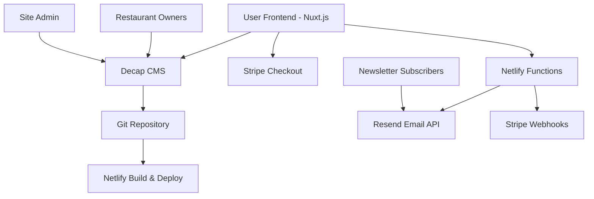

# Design Document

## Overview

The I-90 Restaurant Deals platform is designed as a simplified, maintainable system that delivers location-based restaurant deals through email newsletters. The architecture prioritizes simplicity, reliability, and ease of maintenance while providing essential functionality for both subscribers and restaurant owners.

## Architecture

### High-Level Architecture



### Technology Stack

**Frontend:**

- **Nuxt.js 3** - Static site generation with dynamic capabilities
- **Tailwind CSS** - Utility-first styling
- **Vue 3** - Component framework

**Content Management:**

- **Decap CMS** - Git-based headless CMS
- **Markdown + YAML** - Content storage format
- **Git Repository** - Version control and content storage

**Backend Services:**

- **Netlify Functions** - Serverless functions for API endpoints
- **Stripe** - Payment processing (monthly subscriptions with simplified webhook handling)
- **Resend** - Transactional email service

**Deployment:**

- **Netlify** - Static hosting with serverless functions
- **Git-based deployment** - Automatic builds on content changes

### Simplified Data Flow

1. **User Subscription**: Users subscribe to newsletter with monthly billing via Stripe
2. **Restaurant Subscription**: Restaurant owners subscribe to listing service (basic/premium)
3. **Content Creation**: Restaurant owners use Decap CMS to manage profiles and deals
4. **Static Generation**: Netlify builds static pages from Git content
5. **Newsletter Compilation**: Weekly function aggregates deals by location, prioritizing premium restaurants
6. **Email Distribution**: Resend sends personalized newsletters to active subscribers only
7. **Subscription Management**: Stripe webhooks handle subscription status changes, failed payments, and cancellations

## Components and Interfaces

### Frontend Components

#### Core Pages

- **Homepage** (`pages/index.vue`)
  - Hero section with newsletter signup
  - Featured deals preview
  - Location selection interface
  - Value proposition messaging

- **Restaurant Directory** (`pages/directory.vue`)
  - Filterable restaurant listings
  - Location and cuisine filters
  - Restaurant cards with current deals
  - Search functionality

- **Restaurant Detail Pages** (`pages/restaurant/[slug].vue`)
  - Restaurant information
  - Current deals prominently displayed
  - Contact information and directions
  - Newsletter signup CTA

- **Newsletter Signup** (`pages/subscribe.vue`)
  - Location selection (I-90 cities)
  - Stripe payment integration
  - Email confirmation flow

#### Reusable Components

- **RestaurantCard** - Display restaurant info and deals
- **LocationSelector** - I-90 city/region selection
- **DealCard** - Individual deal display
- **NewsletterSignup** - Subscription form component
- **LocationFilter** - Filter restaurants by I-90 locations

### Content Management Interface

#### Decap CMS Configuration

```yaml
# admin/config.yml
backend:
  name: git-gateway
  branch: main

collections:
  - name: "restaurants"
    label: "Restaurants"
    folder: "content/restaurants"
    create: true
    fields:
      - { label: "Name", name: "title", widget: "string" }
      - { label: "Slug", name: "slug", widget: "string" }
      - {
          label: "Location",
          name: "location",
          widget: "select",
          options:
            [
              "Seattle, WA",
              "Spokane, WA",
              "Missoula, MT",
              "Billings, MT",
              "Rapid City, SD",
              "Sioux Falls, SD",
              "Des Moines, IA",
              "Chicago, IL",
              "Toledo, OH",
              "Cleveland, OH",
              "Buffalo, NY",
              "Albany, NY",
              "Boston, MA",
            ],
        }
      - { label: "Cuisine Type", name: "cuisine", widget: "string" }
      - { label: "Address", name: "address", widget: "text" }
      - { label: "Phone", name: "phone", widget: "string" }
      - { label: "Website", name: "website", widget: "string", required: false }
      - { label: "Description", name: "description", widget: "text" }
      - { label: "Current Deals", name: "deals", widget: "markdown" }
      - {
          label: "Premium Listing",
          name: "premium",
          widget: "boolean",
          default: false,
        }
      - {
          label: "Featured Image",
          name: "image",
          widget: "image",
          required: false,
        }
```

### API Endpoints (Netlify Functions)

#### Newsletter Management

- **`/api/subscribe`** - Handle newsletter subscriptions with monthly billing
- **`/api/restaurant-subscribe`** - Handle restaurant listing subscriptions (basic/premium tiers)
- **`/api/send-newsletter`** - Weekly newsletter compilation and sending
- **`/api/stripe-webhook`** - Handle Stripe subscription events (created, updated, cancelled, payment_failed)
- **`/api/manage-subscription`** - Allow users to update/cancel subscriptions

#### Content APIs

- **`/api/restaurants`** - Get restaurant data (if needed for dynamic features)
- **`/api/deals`** - Get current deals by location

## Subscription Tiers and Pricing

### User Newsletter Subscription

- **Monthly Price**: $2.99/month
- **Features**:
  - Weekly newsletter with deals from selected I-90 locations
  - Access to restaurant directory
  - Mobile-optimized deal notifications

### Restaurant Listing Subscriptions

#### Basic Tier

- **Monthly Price**: $9.99/month
- **Features**:
  - Restaurant listing in directory
  - Ability to post and update deals
  - Inclusion in weekly newsletter
  - Basic analytics (email opens)

#### Premium Tier

- **Monthly Price**: $19.99/month
- **Features**:
  - All Basic tier features
  - Priority placement in newsletters
  - Featured badge in directory
  - Enhanced analytics (clicks, engagement)
  - Premium support

### Stripe Product Configuration

```javascript
// Newsletter subscription
const newsletterPrice = {
  unit_amount: 299, // $2.99
  currency: "usd",
  recurring: { interval: "month" },
};

// Restaurant Basic
const restaurantBasicPrice = {
  unit_amount: 999, // $9.99
  currency: "usd",
  recurring: { interval: "month" },
};

// Restaurant Premium
const restaurantPremiumPrice = {
  unit_amount: 1999, // $19.99
  currency: "usd",
  recurring: { interval: "month" },
};
```

## Data Models

### Restaurant Model

```typescript
interface Restaurant {
  title: string;
  slug: string;
  location: I90Location;
  cuisine: string;
  address: string;
  phone: string;
  website?: string;
  description: string;
  deals: string; // Markdown content
  premium: boolean;
  image?: string;
  createdAt: Date;
  updatedAt: Date;
}
```

### Subscriber Model

```typescript
interface Subscriber {
  email: string;
  locations: I90Location[];
  stripeCustomerId: string;
  stripeSubscriptionId: string;
  subscriptionStatus: "active" | "past_due" | "cancelled" | "unpaid";
  subscribedAt: Date;
  currentPeriodEnd: Date;
}
```

### Restaurant Subscription Model

```typescript
interface RestaurantSubscription {
  restaurantSlug: string;
  ownerEmail: string;
  stripeCustomerId: string;
  stripeSubscriptionId: string;
  subscriptionTier: "basic" | "premium";
  subscriptionStatus: "active" | "past_due" | "cancelled" | "unpaid";
  subscribedAt: Date;
  currentPeriodEnd: Date;
}
```

### Deal Model (Extracted from Restaurant)

```typescript
interface Deal {
  restaurantSlug: string;
  restaurantName: string;
  location: I90Location;
  dealContent: string;
  isPremium: boolean;
  lastUpdated: Date;
}
```

### I-90 Locations

```typescript
type I90Location =
  | "Seattle, WA"
  | "Spokane, WA"
  | "Missoula, MT"
  | "Billings, MT"
  | "Rapid City, SD"
  | "Sioux Falls, SD"
  | "Des Moines, IA"
  | "Chicago, IL"
  | "Toledo, OH"
  | "Cleveland, OH"
  | "Buffalo, NY"
  | "Albany, NY"
  | "Boston, MA";
```

## Error Handling

### Frontend Error Handling

- **Network Errors**: Graceful fallbacks for API failures
- **Payment Errors**: Clear Stripe error messaging
- **Form Validation**: Client-side validation with helpful messages
- **404 Handling**: Custom 404 page for missing restaurants

### Backend Error Handling

- **Email Delivery**: Log failures, retry mechanism for newsletter sending
- **Payment Processing**: Proper Stripe webhook error handling
- **Content Loading**: Fallbacks for missing or malformed content
- **Rate Limiting**: Prevent abuse of API endpoints

### Monitoring and Logging

- **Netlify Functions**: Built-in logging for serverless functions
- **Email Delivery**: Track delivery status through Resend
- **Payment Events**: Log all Stripe webhook events
- **Error Tracking**: Simple error logging (console/Netlify logs)

## Testing Strategy

### Automated Testing

- **Unit Tests**: Core utility functions and data processing
- **Component Tests**: Vue component functionality
- **Integration Tests**: Newsletter compilation and sending
- **E2E Tests**: Critical user flows (subscription, restaurant browsing)

### Manual Testing Checklist

- **Newsletter Flow**: Subscribe → receive welcome email → receive weekly newsletter
- **Content Management**: Add restaurant → update deals → verify in newsletter
- **Payment Flow**: Subscribe → Stripe checkout → webhook processing
- **Mobile Experience**: Test all features on mobile devices

### Testing Data

- **Sample Restaurants**: Create test restaurants in each I-90 location
- **Test Subscribers**: Multiple test email addresses with different location preferences
- **Mock Deals**: Various deal types and expiration dates for testing

## Performance Optimization

### Static Generation

- **Pre-built Pages**: All restaurant pages generated at build time
- **Incremental Builds**: Only rebuild changed content
- **CDN Distribution**: Netlify CDN for global performance

### Image Optimization

- **Responsive Images**: Multiple sizes for different devices
- **WebP Format**: Modern image formats with fallbacks
- **Lazy Loading**: Load images as needed

### Bundle Optimization

- **Code Splitting**: Separate chunks for different page types
- **Tree Shaking**: Remove unused code
- **Minimal JavaScript**: Static-first approach reduces JS bundle size

## Security Considerations

### Data Protection

- **No User Database**: Minimal personal data storage
- **Stripe Security**: PCI compliance through Stripe
- **Email Security**: Secure email handling through Resend

### Content Security

- **Git-based CMS**: Version control for all content changes
- **Admin Access**: Controlled access to Decap CMS
- **Input Validation**: Sanitize all user inputs

### API Security

- **Rate Limiting**: Prevent API abuse
- **CORS Configuration**: Proper cross-origin settings
- **Environment Variables**: Secure storage of API keys

## Deployment Strategy

### Development Workflow

1. **Local Development**: `npm run dev` with hot reloading
2. **Content Changes**: Edit through Decap CMS or direct Git commits
3. **Automatic Builds**: Netlify builds on Git changes
4. **Preview Deployments**: Branch previews for testing

### Production Deployment

1. **Main Branch**: Production deployments from main branch
2. **Build Process**: Static generation with Netlify
3. **Function Deployment**: Serverless functions deployed with site
4. **Environment Configuration**: Production environment variables

### Rollback Strategy

- **Git Revert**: Easy rollback through Git history
- **Netlify Rollback**: One-click rollback to previous deployment
- **Content Rollback**: Revert content changes through Git

## Scalability Considerations

### Content Scaling

- **Static Generation**: Handles thousands of restaurants efficiently
- **CDN Caching**: Global content distribution
- **Build Optimization**: Incremental builds for large content sets

### Email Scaling

- **Resend Limits**: Monitor email sending limits
- **Batch Processing**: Send newsletters in batches if needed
- **Subscriber Segmentation**: Efficient location-based filtering

### Performance Monitoring

- **Core Web Vitals**: Monitor page performance metrics
- **Newsletter Metrics**: Track open rates and engagement
- **Error Monitoring**: Monitor function errors and failures

This design provides a solid foundation that learns from the complexity issues in your previous project while maintaining the core functionality you need for a successful I-90 restaurant deals platform.
